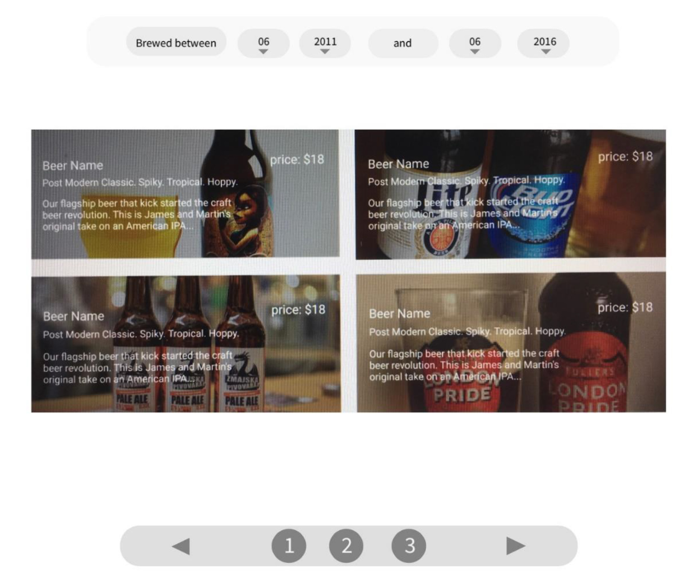

---
The 𝗖𝗥𝗘𝗔𝗟𝗢𝗚𝗜𝗫 Group is a Swiss :switzerland: Fintech :100: company and is among the global market leaders :1st_place_medal: in digital banking. We develop and implement innovative :bulb: fintech solutions to accelerate the digital transformation to an open banking :bank: ecosystem.

You can read more in [Wikipedia](https://de.wikipedia.org/wiki/Crealogix)

## What about this project?
This project is a Job Challenge :man_technologist:!  
We need develop a React app which will show a list of craft beers :beers: that you will get from an Open API.
   
###      :dart: Aspects to Focus
          :white_small_square: Consistent component composition  
          :white_small_square: Clean code  
          :white_small_square: Re-usability  
          :white_small_square: Testing  

###      :pushpin: Endpoint
             :white_small_square: **URL:** [https://api.punkapi.com/v2/beers](https://api.punkapi.com/v2/beers)  
             :white_small_square: **Format:** JSON  
             :white_small_square: **Attributes:**   
                      :small_blue_diamond: image_url  
                      :small_blue_diamond: name  
                      :small_blue_diamond: tagline  
                      :small_blue_diamond: description (max 20 words ellipsed)  

###      :medal_military: Extra bonus points!
             :white_small_square: Test  
             :white_small_square: Use Typescript  
             :white_small_square: Use Redux  
             :white_small_square: Code analysis (eslint)  
             :white_small_square: Code readability (prettier)

###      :warning: Important!
             :white_small_square: Dont use external packages for pagination & filtering.

###      :art: Design Reference

## :package: Tech Stack
* **React:** Library for building user interfaces.
* **Redux:** Predictable state container for JavaScript Apps.
* **Redux-saga:** App side effects, easier to manage, more efficient to execute, easy to test, and better at handling failures.
* **Jest:** Zero configuration testing platform
* **Enzyme:** javaScript Testing utility for React that makes it easier to assert, manipulate, and traverse your React 